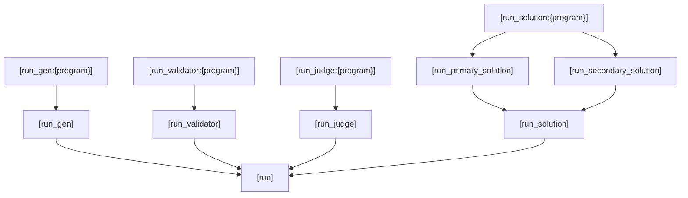
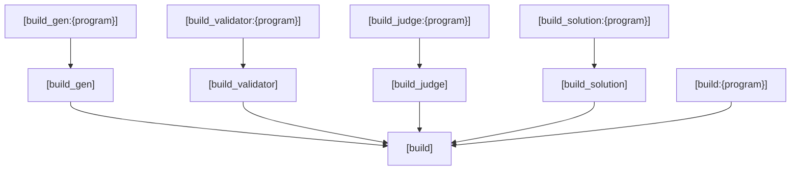

# Config v3 documentation

*If you are just exploring, this page might be a bit daunting.
Don't worry though, you usually need just a small subset of the keys.
Check out our [example tasks](https://github.com/piskoviste/pisek/tree/master/examples)
for how an usual config might look like.*

## Key metadata

Our keys use the following metadata tags:

### <!-- md:version --> – Version {#metadata-version}

The last version the key was **greatly** changed. This is either
its creation, a key rename or a change of the default value.
(Although we try to be [mostly backwards compatible](https://www.explainxkcd.com/wiki/index.php/1172:_Workflow),
the [`version`](#version) `v3` of the config format was experimental for a long time.)

### <!-- md:type --> – Type

Type of the value. See [value types](#value-types).

### <!-- md:default --> – Default

Default value for this key.

### <!-- md:default-empty --> – Empty default

The default value is empty.

### <!-- md:flag required --> – Required

You must set this key.

### <!-- md:flag required-applicable --> – Required if applicable

Depending on other key values, you must either set this key or you cannot use this key.

### <!-- md:flag experimental --> – Experimental

This key is still new and can change.

## Value types
Config keys are internally converted to various types.

These can be basic:

- string
- int
- decimal — Both `3.14` and `2e5` forms are supported.
- bool
    - True values: `1`, `True`, `true`, `t`, `yes`, `y`, `on`
    - False values: `0`, `False`, `false`, `f`, `no`, `n`, `off`
- enum — One of the values specified in the key description.
- 'string literal'
- run_ref — String referencing a [`[run]`](#run) section. Cannot start with an `_`. If this section doesn't exist, it will be auto-generated.
- build_ref — String referencing a [`[build]`](#build) section. Cannot start with an `_`. If this section doesn't exist, it will be auto-generated.

!!! info
    Through auto-expansion and auto-generation run_ref and build_ref values can interpreted as paths.

    But if you are not writing your [`[run]`](#run) or [`[build]`](#build) section
    (and that's not usually needed), just treat these types as the path to your program.

Filesystem:

- path — String, but additionally corresponds to a path in your filesystem.
    - Usually relative to the task directory.
    - Usually already existing.
    - Usually without the file extension.
- glob — A glob describing a set of paths supporting expansion of `*` and `?` as in a shell.

And generics:

- T | U — Either type T or type U
- list[T] — Space separated list of values of type T.

## Reserved values
Values beginning with `!` or `@` are reserved and have special meaning:

- The only `!` value is `!unset`, which makes the key have no value (and thus ignore [higher level defaults](#use)).
- `@` values autoexpand depending on context.


---

## [task]

### version
<!-- md:version 1.0.0 -->
<!-- md:type enum -->
<!-- md:default v1 -->

Version of the task configuration file:

- `v1` - Old version, with a basic set of options.
- `v2` - Old version, with an expanded set of options.
- `v3` - Current version, **recommended**

The version applies to this config file only and cannot be inherited with the use key.
You can use `pisek config update` to update the config to the highest version.

### use
<!-- md:version 1.1.0 -->
<!-- md:type path -->
<!-- md:default-empty -->

Config to use defaults from.

Values of keys are loaded in the following way:

1. We try to find a given (section, key) in the task config.
2. If not found, we go to the config specified by the use key.
3. If the use key in the current config is empty, we go to pisek's global defaults.
4. If we can't find the (section, key) there, we return to step 1 to
   try searching for the defaulting section and key of this key.
5. If there is no defaulting key, we fail as this key is required.

For example, consider:

- `use=organization-config`
- (`[section]`,`key`) defaults to (`[default_section]`,`key`)
- (`[default_section]`,`key`) defaults to `42` if not present

Then we search in this order:

| config                  | section             | key   |
|-------------------------|---------------------|-------|
| this config             | `[section]`         | `key` |
| organization-config     | `[section]`         | `key` |
| pisek's global-defaults | `[section]`         | `key` |
| this config             | `[default_section]` | `key` |
| organization-config     | `[default_section]` | `key` |
| pisek's global-defaults | `[default_section]` | `key` |

### task_type
<!-- md:version 1.0.0 -->
<!-- md:type enum -->
<!-- md:default batch -->

Task type:

- `batch`
- `interactive`

### score_precision
<!-- md:version 1.4.0 -->
<!-- md:type int -->
<!-- md:default 0 -->

How many decimal digits scores are rounded to.

## [tests]

Section for configuring the tests. 

Some keys in it serve as defaults for [`[testXY]`](#testxy). (More details there.)

### has_sample_test
<!-- md:version 2.3.0 -->
<!-- md:type bool -->
<!-- md:default yes -->

Whether this task has [`[test00]`](#test00).

### in_gen
<!-- md:version 1.0.0 -->
<!-- md:type run_ref -->
<!-- md:flag required -->

Reference to the run section specifying how to run the generator. (If empty, only static inputs are used.)

See [`[run]`](#run) for more.

### gen_type
<!-- md:version 1.3.0 -->
<!-- md:type enum -->
<!-- md:flag required-applicable -->

Specifies the generator type. (Required for non-empty [`in_gen`](#in_gen).)

- `pisek-v1` (recommended)
- `cms-old`
- `opendata-v1`

For more info see [generator](./task-parts/generator.md).

### in_format
<!-- md:version 1.7.0 -->
<!-- md:type enum -->
<!-- md:default strict-text -->

### out_format
<!-- md:version 1.7.0 -->
<!-- md:type enum -->
<!-- md:default text -->

Format of input/output:

- `text` — UTF-8 or UTF-16 encoded ASCII printable characters (+ space, tab, LF, CR), with an optional BOM.
  The file will be converted to plain, 8-bit ASCII before being passed to another program.
  All lines (including the last one) are additionally automatically converted to be terminated with a LF character.
- `strict-text` — ASCII printable characters (+ space, tab, LF, CR). All lines (including the last one)
  must already be terminated with a LF character.
- `binary` — Can be anything.

If the input does not conform to `in_format`, failure is immediately reported.
If the output does not conform to `out_format`, it gets the normalization fail verdict.

### validator
<!-- md:version 1.6.0 -->
<!-- md:type run_ref -->
<!-- md:default-empty -->

Reference to the run section specifying how to run the validator.
See [`[run]`](#run) for more.

No value means no checking.

### validator_type
<!-- md:version 2.0.0 -->
<!-- md:type enum -->
<!-- md:flag required-applicable -->

Specifies the validator type (required for non-empty [`validator`](#validator))

- `simple-42` (recommended)
- `simple-0`

For more info see [validator](task-parts/validator.md).

### out_check
<!-- md:version 1.0.0 -->
<!-- md:type enum -->
<!-- md:flag required -->

Describes how to check outputs.

- `diff` — Compare with correct output. (Discouraged option, can be slow in some cases.)
- `tokens` — Compare token-by-token with correct output (tokens are separated by whitespace).
  Newlines are interpreted as tokens unless [disabled](#tokens_ignore_newlines). (Newlines at the end of the file are ignored.)
- `shuffle` — Like `tokens`, but allow permutation of tokens.
- `judge` — Check with a custom program (called a 'judge').

For [`task_type=interactive`](#task_type), only `judge` is allowed.

For more info see [batch checker](./task-parts/batch-checker.md) or [interactive judge](./task-parts/interactive-judge.md).

### out_judge
<!-- md:version 1.0.0 -->
<!-- md:type run_ref -->
<!-- md:flag required-applicable -->

Only for [`out_check=judge`](#out_check) (required in that case).

Reference to the run section specifying how to run the judge.
See [`[run]`](#run) for more.

### judge_type
<!-- md:version 1.1.0 -->
<!-- md:type enum -->
<!-- md:flag required-applicable -->

Only for [`out_check=judge`](#out_check) (required in that case).

Specifies how to call the judge and how the judge reports the verdict.

For [`task_type=batch`](#task_type):

- `cms-batch`
- `opendata-v1`

For [`task_type=interactive`](#task_type):

- `cms-communication`

See [batch checker](./task-parts/batch-checker.md) or [interactive judge](./task-parts/interactive-judge.md) for details.

### judge_needs_in
<!-- md:version 1.0.0 -->
<!-- md:type bool -->
<!-- md:default true -->

Only for [`out_check=judge`](#out_check).

Whether the judge needs the input for checking.

### judge_needs_out
<!-- md:version 1.0.0 -->
<!-- md:type bool -->
<!-- md:default true -->

Only for [`out_check=judge`](#out_check).

Whether the judge needs the correct output for checking.

### tokens_ignore_newlines
<!-- md:version 1.2.0 -->
<!-- md:type bool -->
<!-- md:default false -->

Only for [`out_check=tokens`](#out_check).

If set to `true`, newline characters will be ignored when checking the output,
as if they were any other whitespace characters.
Otherwise, newline characters are only ignored at the end of the file.

### tokens_ignore_case
<!-- md:version 1.2.0 -->
<!-- md:type bool -->
<!-- md:default false -->

Only for [`out_check=tokens`](#out_check).

If set to `true`, ASCII characters will be compared in a case-insensitive manner.

### tokens_float_rel_error
<!-- md:version 1.2.0 -->
<!-- md:type decimal -->
<!-- md:default-empty -->

### tokens_float_abs_error
<!-- md:version 1.2.0 -->
<!-- md:type decimal -->
<!-- md:default-empty -->

Only for [`out_check=tokens`](#out_check).

When these options are specified, floating-point numbers will be parsed and compared
with a given error margin. Any tokens that can't be parsed as a float will be compared
character-by-character. If used, both of these options must be specified.
To explicitly disable float checking, set both options to the empty string.

### shuffle_mode
<!-- md:version 1.5.0 -->
<!-- md:type enum -->
<!-- md:flag required-applicable -->

Only for [`out_check=shuffle`](#out_check) (required in that case).

Which permutations are allowed:

- `lines` — Permutation of lines
- `words` — Permutation of words within each line
- `lines_words` — Both lines and words
- `tokens` — Permutation of all tokens, ignoring line boundaries

### shuffle_ignore_case
<!-- md:version 1.5.0 -->
<!-- md:type bool -->
<!-- md:default false -->

Only for [`out_check=shuffle`](#out_check).

If set to `true`, ASCII characters will be compared in a case-insensitive manner.

### static_subdir
<!-- md:version 1.0.0 -->
<!-- md:type path -->
<!-- md:default . -->

Try to find static inputs and outputs in this folder.

### name
<!-- md:version 1.0.0 -->
<!-- md:type string -->
<!-- md:default @auto -->

Name of this test. Default for `name` in each [`[testXY]`](#testxy).

`@auto` expands to `Test {test number}`.

### points
<!-- md:version 1.0.0 -->
<!-- md:type decimal | 'unscored' -->
<!-- md:flag required -->

Number of points for this test. Default for `points` in each [`[testXY]`](#testxy).

If `points=unscored`, it is not possible to get any points for this test.
(Unlike `points=0`, where some [`judge_type`](#judge_type)s might give more than the maximum number of points.)

(Required in [`[tests]`](#tests) or each [`[testXY]`](#testxy).)

### in_globs
<!-- md:version 1.0.0 -->
<!-- md:type list[glob] -->
<!-- md:default @ith -->

Which inputs this test contains. Gets combined with inputs specified by the `predecessors` key. Default for `in_globs` in each [`[testXY]`](#testxy).

The globs select the input filenames they match. The filenames for unseeded inputs are in the form `{name}.in` and for seeded inputs `{name}_{seed}.in`.
The globs **must** match the `_{seed}` part with `*` and end with `.in`.

`@ith` expands to `{test_number:02}*.in`.

### predecessors
<!-- md:version 1.0.0 -->
<!-- md:type list[int] -->
<!-- md:default-empty -->

List of tests easier than this test. Default for `predecessors` in each [`[testXY]`](#testxy).

Inputs from these tests are included into this test as well.

`@previous` expands to previous test (or nothing if the test has number ≤ 1).

---

Keys for enabling/disabling checks that the task must satisfy.

!!! danger
    Please be careful when disabling checks as it can transform task preparation into a minefield.

### checks.no_unused_inputs
<!-- md:version 2.3.0 -->
<!-- md:type bool -->
<!-- md:default on -->

Checks that there are no unused inputs in the entire task, both in the [`static_subdir`](#static_subdir)
or generated by the [generator](./task-parts/generator.md).

### checks.all_inputs_in_last_test
<!-- md:version 2.3.0 -->
<!-- md:type bool -->
<!-- md:default off -->

Checks that all inputs are included in the last test.

### checks.one_input_in_each_nonsample_test
<!-- md:version 2.3.0 -->
<!-- md:type bool -->
<!-- md:default off -->

Checks that each test (excluding samples) contains exactly one input.
Useful for opendata tasks.

### checks.generator_respects_seed
<!-- md:version 2.3.0 -->
<!-- md:type bool -->
<!-- md:default on -->

Checks that the generator generates two different inputs for two different seeds.

### checks.validate
<!-- md:version 2.0.0 -->
<!-- md:type bool -->
<!-- md:default on -->

If `on`, run the [`validator`](#validator) on inputs from this test.

### checks.solution_for_this_test
<!-- md:version 2.3.0 -->
<!-- md:type bool -->
<!-- md:default off -->

Checks that a dedicated solution exists for this test (ignored for [`[test00]`](#test00)).

A dedicated solution for a test is one that:

- Gets full points on this test and its predecessors.
- Doesn't get full points on all other tests.

### checks.different_outputs
<!-- md:version 2.0.0 -->
<!-- md:type bool -->
<!-- md:default on -->

Checks that not all of the primary solution's outputs on this test are the same.
(Only if there are at least 2 testcases.)

### checks.fuzzing_thoroughness
<!-- md:version 2.3.0 -->
<!-- md:type int -->
<!-- md:default 250 -->

Only for [`out_check=judge`](#out_check).

Checks that the judge doesn't crash on randomly generated malicious outputs.
They are generated by modifying correct outputs:

- 1/10 are cut off in the middle.
- 1/10 have a line replaced by an empty line
- 4/5 have a token substituted for another one.

The key specifies the number of malicious outputs to test. Set to `0` to disable.

### checks.judge_rejects_trailing_string
<!-- md:version 2.3.0 -->
<!-- md:type bool -->
<!-- md:default on -->

Only for [`out_check=judge`](#out_check).

Checks that outputs that have a trailing string added to the end are judged as wrong answer.

### opendata.online_validity
<!-- md:version 2.3.0 -->
<!-- md:type int | 'unlimited' -->
<!-- md:default 300 -->

Reserved key for the opendata module.

## [testXY]
A section for a specific test.

The test sections are numbered `[test00]`, `[test01]`, `[test02]`,…
The [`[test00]`](#test00) section is optional, while all others (up to the number of tests) are required.

The allowed keys in this section are:

- [`name`](#name)
- [`points`](#points)
- [`in_globs`](#in_globs)
- [`predecessors`](#predecessors)
- [`checks.generator_respects_seed`](#checksgenerator_respects_seed)
- [`checks.validate`](#checksvalidate)
- [`checks.solution_for_this_test`](#checkssolution_for_this_test)
- [`checks.different_outputs`](#checksdifferent_outputs)

If they are not provided, their default from the [`[tests]`](#tests) section is used.

!!! example "Task with two tests"
    - Easy test contains inputs `01*.in`
    - Hard test contains inputs `01*.in` and `02*.in`

    ```ini
    [test01]
    name=Easy test
    points=4

    [test02]
    name=Hard test
    points=6
    predecessors=1
    ```

## [test00]
The section for the test containing samples. Has different defaults for a few keys:

```ini
name=Samples
points=unscored
in_globs=sample*.in
opendata.online_validity=unlimited
```

## [solutions]
Defaults for all solutions.

### run {#solution-run}
<!-- md:version 1.6.0 -->
<!-- md:type run_ref -->
<!-- md:default @auto -->

Reference to the run section specifying how to run this solution.
See [`[run]`](#run) for more

`@auto` expands to name of the section without `solution_`.
(For example, if the section name were `[solution_correct]`, `@auto` would expand to `correct`.)

### primary
<!-- md:version 1.0.0 -->
<!-- md:type bool -->
<!-- md:default false -->

Use this solution to generate the reference outputs?

Exactly one solution has to be set to primary
(or zero if there are no solutions in the config).

### tests
<!-- md:version 1.6.0 -->
<!-- md:type string -->
<!-- md:default @auto -->

A string describing the expected result on each test. It should have one character for each test, including [`[test00]`](#test00).

Recognized results are:

- `1` — success
- `0` — fail
- `P` — partial success
- `S` — superoptimal success
- `A` — success / superoptimal success
- `W` — wrong answer
- `!` — runtime error
- `T` — timeout
- `N` — normalization fail
- `X` — any result

The result of a test is the result of the worst testcase.
`W!TN` require at least one testcase with the corresponding verdict.

- `@all` — string of `11...`
- `@any` — string of `XX...`
- `@auto` — `@all` if this is primary solution, `@any` otherwise

### points
<!-- md:version 1.0.0 -->
<!-- md:type decimal | 'X' -->
<!-- md:default X -->

Points that program should get or `X` for any number of points.

### points_min
<!-- md:version 1.7.0 -->
<!-- md:type decimal | 'X' -->
<!-- md:default X -->

### points_max
<!-- md:version 1.7.0 -->
<!-- md:type decimal | 'X' -->
<!-- md:default X -->

Upper and lower bounds on points.

Cannot be set simultaneously with [`points`](#points).

## [solution_correct]

A section for a specific solution. This one is named `correct`.

!!! example Task with multiple solutions
    For a task with samples, two other tests and solutions `correct.py`, `wrong.cpp` and `slow.java`
    the config might look like this:
    ```ini
    [solution_correct]
    # primary solution must pass on all tests
    primary=yes

    [solution_wrong]
    # we don't really care about samples, otherwise wrong
    tests=XWW

    [solution_slow]
    # timeout on test02, otherwise correct
    tests=11T
    ```


## [run]
Sections describing how to run a program.

The run section for each program is optional. If it is missing, its contents are autogenerated,
by looking for most specific section with the given key set, according to this hierarchy:


!!! note
    Tasks usually only have a couple of `[run]` sections:
    ```ini
    [run_solution]
    time_limit=1
    subdir=solutions

    [run_judge]
    time_limit=2
    ```

### build {#run-build}
<!-- md:version 2.0.0 -->
<!-- md:type build_ref -->
<!-- md:default @auto -->

Reference to the build section specifying how to build this program.

`@auto` expands to `{program_role}:{subdir}/{program}`, e.g. `solution:solutions/solve`.

See [`[build]`](#build) for more.

### exec
<!-- md:version 1.6.0 -->
<!-- md:type path -->
<!-- md:default-empty -->

Filename of the program to execute relative to the built directory.
If a directory is chosen `{exec}/run` is executed instead.

Defaults to empty (which chooses the built file / directory itself).

### args
<!-- md:version 1.6.0 -->
<!-- md:type string -->
<!-- md:default-empty -->

Additional arguments for the program. (Given before any other arguments.)

### subdir
<!-- md:version 1.6.0 -->
<!-- md:type path -->
<!-- md:default-empty -->

Subdirectory where to look for the program. (If empty, the task root is used.) Only used if [`build`](#run-build) is not set.

### time_limit
<!-- md:version 1.6.0 -->
<!-- md:type decimal -->
<!-- md:default 360 -->

Execution time limit [seconds]. (`0` for unlimited.)

### clock_mul
<!-- md:version 1.6.0 -->
<!-- md:type decimal -->
<!-- md:default 2 -->

Wall clock multiplier [1]. (`0` for unlimited.)

The wall clock limit will be computed as `max(time_limit * clock_mul, clock_min)`.

### clock_min
<!-- md:version 1.6.0 -->
<!-- md:type decimal -->
<!-- md:default 1 -->

Wall clock minimum [seconds].

### mem_limit
<!-- md:version 1.6.0 -->
<!-- md:type int -->
<!-- md:default 0 -->

Memory limit [MB]. (`0` for unlimited.)

### process_limit
<!-- md:version 1.6.0 -->
<!-- md:type int -->
<!-- md:default 1 -->

Maximum number of processes. (`0` for unlimited.)

Please keep in mind that killing multiple processes
upon errors is inherently unreliable.

!!! danger
    At the moment limits greater than `1` are interpreted as "unlimited".

### env_{KEY}
<!-- md:version 2.1.0 -->
<!-- md:type string -->
<!-- md:default-empty -->

Sets an environment variable when running this program. You can use `${...}` interpolation for substituting environment variables.

??? example "`env_{KEY}` usage"
    For example `env_DEBUG=true` sets `DEBUG` to have value `true`.

    When running pisek with `TASK` set to `aplusb`, `env_DATASET=../{TASK}` produces `DATASET=../aplusb`. (However, the program will have no access to `TASK` by default.)

## [build]
Sections describing how to build a program.

The build section for each program is optional. If it is missing, its contents are autogenerated,
by looking for most specific section with the given key set, according to this hierarchy:

Build sections must have different `{program}` suffixes. For multi-role programs, using `[build:{program}]` is recommended.

!!! note
    For single file programs in [supported languages](#strategy), writing your own build section is rarely needed.

### sources
<!-- md:version 2.0.0 -->
<!-- md:type list[path] -->
<!-- md:default @auto -->

List of sources needed for building the executable.

`@auto` expands to `{program}`.

### comp_args
<!-- md:version 2.0.0 -->
<!-- md:type string -->
<!-- md:default-empty -->

Additional compiler arguments (given after any other arguments).

### extras
<!-- md:version 2.0.0 -->
<!-- md:type list[path] -->
<!-- md:default-empty -->

Additional files to be copied to the build directory (**with** suffixes).

### entrypoint
<!-- md:version 2.0.0 -->
<!-- md:type path -->
<!-- md:default-empty -->

For building some executables (e.g. python), an entrypoint is needed (just the filename).

### strategy
<!-- md:version 2.0.0 -->
<!-- md:type enum -->
<!-- md:default auto -->

Build strategy for building this program.

`auto` detects automatically which strategy to use depending on file suffixes.

Other strategies are:

- `python`
- `shell`
- `c`
- `cpp`
- `pascal`
- `java`
- `go`
- `make`
- `cargo`


### headers_c
<!-- md:version 2.0.0 -->
<!-- md:type list[path] -->
<!-- md:default-empty -->

Headers to include in the `c` [`strategy`](#strategy) (**with** suffixes).

### extra_sources_c
<!-- md:version 2.0.0 -->
<!-- md:type list[path] -->
<!-- md:default-empty -->

Extra source files for the `c` [`strategy`](#strategy).

### headers_cpp
<!-- md:version 2.0.0 -->
<!-- md:type list[path] -->
<!-- md:default-empty -->

Headers to include in the `cpp` [`strategy`](#strategy) (**with** suffixes).

### extra_sources_cpp
<!-- md:version 2.0.0 -->
<!-- md:type list[path] -->
<!-- md:default-empty -->

Extra source files for the `cpp` [`strategy`](#strategy).

### extra_sources_java
<!-- md:version 2.0.0 -->
<!-- md:type list[path] -->
<!-- md:default-empty -->

Extra source files for the `java` [`strategy`](#strategy).

### extra_sources_py
<!-- md:version 2.1.0 -->
<!-- md:type list[path] -->
<!-- md:default-empty -->

Extra source files for the `python` [`strategy`](#strategy).

---

It is recommended to set headers and extra_sources keys in higher sections (`[build_solution]`, `[build]`,...)
and use the [`sources`](#sources) and [`extras`](#extras) keys for program-specific sections.

??? tip "Stubs and headers"
    ```ini
    [build_solution]
    headers_c=src/guess.h
    extra_sources_c=src/stub.c
    headers_cpp=src/guess.h
    extra_sources_cpp=src/stub.cpp
    extra_sources_py=src/python.py
    ```

## [limits]
Section with input/output size limits.

### input_max_size
<!-- md:version 1.0.0 -->
<!-- md:type int -->
<!-- md:default 50 -->

Maximum input size [MB]. (`0` for unlimited.)

### output_max_size
<!-- md:version 1.0.0 -->
<!-- md:type int -->
<!-- md:default 10 -->

Maximum output size [MB]. (`0` for unlimited.)

## [cms]
Settings related to the CMS importer. See [CMS docs](https://cms.readthedocs.io/en/latest/) for details.

### name
<!-- md:version 1.6.0 -->
<!-- md:type string -->
<!-- md:default-empty -->

The name of the task, which will appear in the task URL (required for CMS commands).

### title
<!-- md:version 1.0.0 -->
<!-- md:type string -->
<!-- md:default @name -->

The name of the task shown on the task description page.

`@name` expands to the task name.

### submission_format
<!-- md:version 1.0.0 -->
<!-- md:type string -->
<!-- md:default @name -->

The name of the submitted file. `.%l` will be replaced with the language's file extension.

`@name` expands to to the task name with non-alphanumeric characters replaced with `_` and `.%l` appended.

### time_limit
<!-- md:version 1.0.0 -->
<!-- md:type decimal -->
<!-- md:default 1 -->

Execution time limit [seconds].

### mem_limit
<!-- md:version 1.0.0 -->
<!-- md:type int -->
<!-- md:default 1024 -->

Memory limit [MB].

### max_submissions
<!-- md:version 1.0.0 -->
<!-- md:type int | 'X' -->
<!-- md:default 50 -->

The number of submissions one contestant is allowed to make, or `X` for unlimited.

### min_submission_interval
<!-- md:version 1.0.0 -->
<!-- md:type int -->
<!-- md:default 0 -->

The number of seconds a contestant has to wait between consecutive submissions.

### score_mode
<!-- md:version 1.0.0 -->
<!-- md:type enum -->
<!-- md:default max_subtask -->

Describes how the final score is computed from the scores of individual submissions.
May be `max`, `max_subtask` or `max_tokened_last`.

### feedback_level
<!-- md:version 1.0.0 -->
<!-- md:type enum -->
<!-- md:default restricted -->

Specifies how much information is given to the contestants about their submission.
May be `full`, `restricted` or `oi_restricted`.

### stubs
<!-- md:version 2.0.0 -->
<!-- md:type list[path] -->
<!-- md:default @auto -->

Only for C/C++/Python.

Stubs to upload to CMS (without suffix).

`@auto` expands to the union of [`[build_solution]`](#build)'s `extra_sources_*` keys.

Used commonly for interactive tasks.

### headers
<!-- md:version 2.0.0 -->
<!-- md:type list[path] -->
<!-- md:default @auto -->

Only for C/C++/Python.

Stubs to upload to CMS (without suffix).

`@auto` expands to the union of [`[build_solution]`](#build)'s `headers_*` keys.

Used commonly for interactive tasks.
