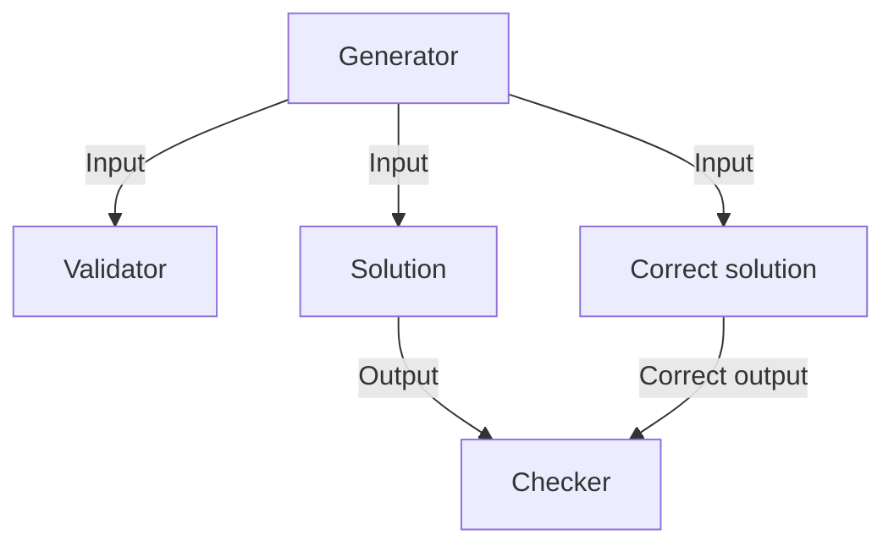
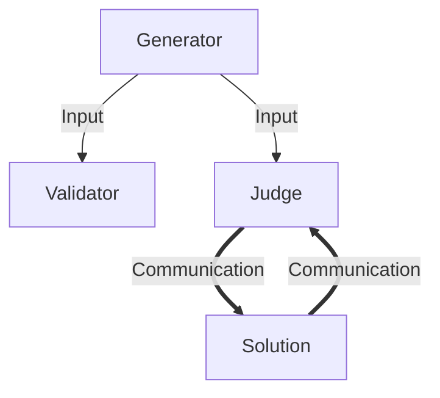

# Task overview
*The Task overview is for those who are familiar with competitive programming but haven't made tasks yet.
If you already made some tasks, you can just look at the task type diagrams
for a [batch task](#batch-task) and an [interactive task](#interactive-task)
to brush up on potential differences in terminology.*

## Task parts

There are several task parts the author needs to write:

### Task statement

The task statement is there for contestant to read.
Pisek doesn't handle task statements, so you are free to write them however you want.

### Tests

Pisek however does need to know about tests (groups of testcases). Those usually are
some additional restrictions on the task statements to allow weaker solutions to get some points.
These can be lower limits for slower solutions, or special cases of the original task statement.

Some tasks have only one test (i.e. ICPC tasks) while others have many (IOI tasks).
Tests need to be entered in the config.

### Solution

The first and best known task component is the solution.
It is the same as what the contestant should write - taking the input and producing the output.

One of the solutions should be the **primary solution**, always producing the correct output.
It is also recommended to write some wrong solutions to ensure they don't pass.

### [Generator](./task-parts/generator.md)

The generator is used for generating inputs that the solution is tested upon.
Ideally the generator should generate diverse enough inputs to break any wrong solution.

### Checker

The checker is used for determining whether a given solution is correct.
It greatly differs between task types, so you can read more there.

A task-specific checker provided by the task author is called a **judge**.

### [Validator](./task-parts/validator.md)

The validator is used for validating inputs produced by generator
conform to the task statement. It adds an additional degree of safety.

## Task types

There are few types of tasks pisek supports:

1. [Batch tasks](#batch-task)
2. [Interactive tasks](#interactive-task)

### Batch task

#### [Batch checkers](./task-parts/batch-checker.md)

A batch checker gets the solution output and should say whether it is correct.
It can also get the correct output (from the primary solution) if specified in the config.

### Interactive task

Interactive task should be used when part of the input should remain hidden
from the contestant's solution. For example when it can ask questions about the input.

#### [Interactive judge](./task-parts/interactive-judge.md)

The judge in a interactive task gets the task input and is run together with the solution.
The solution can make requests to the judge about the input. Finally, the judge says
whether the solution is correct.

One example would be that judge gets a hidden sequence in the input.
The solution then makes queries to the judge and reconstructs the hidden sequence.
After giving this sequence to the judge, the solution is marked by the judge
as correct on this input.
